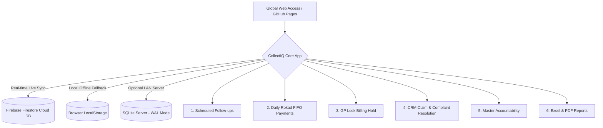
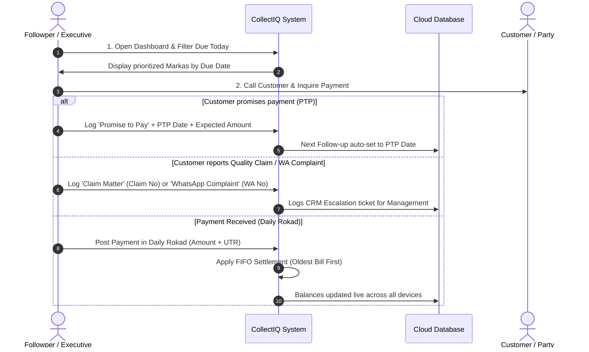

# STANDARD OPERATING PROCEDURE (SOP)
## CollectIQ — Payment Collection & Receivables Command Center
**Document Version**: 4.0 (Production Release)  
**System Type**: Web-Based Multi-User Receivables & Follow-Up Management System  
**Cloud Database Engine**: Google Firebase Firestore (`collectiq-ba467`)  
**Deployment Platform**: GitHub Pages (Global HTTPS Access) / Standalone Desktop Cache  

---

## 1. Executive Summary & System Architecture

CollectIQ is the centralized payment collection, follow-up scheduling, and receivables accountability platform designed for managing high-volume trading accounts.

---

## 2. Access Details & Credentials

### A. Live System URL
* **Production Web Link**: `https://<your-github-username>.github.io/<your-repo-name>/`
* **Local / Office Server**: `http://localhost:3000` (or `http://<OFFICE_IP>:3000`)

### B. Pre-Configured Cloud Database (Firebase)
* **Project ID**: `collectiq-ba467`
* **Database Type**: Cloud Firestore (Test Mode - Multi-Device Read/Write Enabled)
* **Sync Mode**: Bidirectional Real-Time Listener (Updates reflect across all devices instantly without page refresh).

---

## 3. Master Accountability & Staff Assignments

Each Marka belongs to a designated **Master**. The system automatically maps default accountable Followpers as follows:

| Master Name | Default Accountable Followper | Operational Role |
| :--- | :--- | :--- |
| **MANISH MASTER** | **Girdharilal** | Collection Specialist |
| **RAJESH MASTER** | **Girdharilal** | Collection Specialist |
| **RIPTESH / RIPETSH MASTER** | **Girdharilal** | Collection Specialist |
| **KUNAL MASTER** | **Mahavir** | Senior Collection Officer |
| **GUDDU MASTER** | **Mahavir** | Senior Collection Officer |
| **KALPESH MASTER** | **Sajjan** | Recovery Specialist |
| **BABLU MASTER / BABLU SHERA** | **Surendra** | Field Collection Executive |
| **11 MASTER** | **Girdharilal** | Key Accounts Lead |

> [!NOTE]
> To reassign any Master's default Followper, go to **Marka & Followper** $\rightarrow$ **Master Accountability Master** tab $\rightarrow$ click **Change Followper**. Check the box to auto-sync all existing Markas under that Master.

---

## 4. End-to-End Operational SOPs

---

### SOP 1: Daily Morning Follow-Up Routine

1. **Review Dashboard Indicators**:
   * Check **`TOTAL OUTSTANDING`** and **`ALREADY DUE (POLICY)`** metrics.
   * Check the **Control Alert Banner** for any GP-locked accounts or unassigned Markas.
2. **Navigate to "Follow-up schedule" (`#schedule`)**:
   * Click the **Due today** or **Overdue** tabs.
   * Filter by your name under the **Followper** dropdown.
3. **Execute Calls & Log Conversation**:
   * Click **Update** on the target Marka row.
   * Verify **Actual Follow-up Date** (defaults to today's real date).
   * Enter **Contact Person** and select **Contact Mode** (Phone call / WhatsApp / Email / In person).
   * Choose **Action / Status**:
     * **`Promise to Pay`**: Enter **Expected Amount** and **Promise Date** (*Next Follow-up date is automatically locked to the promise date*).
     * **`Payment Delayed` / `Not Responding` / `Dispute`**: Set next follow-up interval (default +2 days).
     * **`Claim Matter`**: Enter mandatory **Claim / Complaint Number**.
     * **`WhatsApp Complaint`**: Enter mandatory **WhatsApp Ticket Reference**.
     * **`Escalated`**: Select target manager (**Saurav Bhai**, **Sales HOD**, **Accounts**, **CRM**, or **Masters**). Account ownership transfers immediately to the manager.
   * Enter conversation notes in **Conversation / remark** $\rightarrow$ click **Save & schedule**.

---

### SOP 2: Daily Rokad Payment Entry (FIFO Settlement)

1. Navigate to **Daily Rokad** (`#rokad`) $\rightarrow$ click **`+ Record payment`**.
2. Fill in payment header:
   * **Received Date**: Date money hit bank/cash.
   * **Mode**: Bank transfer / Cheque / UPI / Cash.
   * **Receipt / UTR**: Bank transaction reference number.
   * **Total Received (₹)**: Gross received amount.
   * **Select Marka**: Choose the paying Marka from the dropdown.
3. **FIFO Allocation Preview**:
   * The system automatically allocates money to the **oldest unpaid bill first**, then carries remaining balance forward to subsequent bills.
   * Visual badges indicate **`SETTLED ✓`** (fully paid) or **`PART ◐`** (partially paid).
4. Click **`Post to Rokad`**:
   * If balance remains $> 0$, the system automatically reschedules a follow-up in 2 days.
   * If total balance becomes $0$, the Marka is marked **`CLEARED`** and removed from active queues.

---

### SOP 3: GP Lock (19+ Days Overdue Hold Policy)

* **Rule**: Any Marka whose scheduled follow-up is overdue by **19 days or more** is automatically placed in **GP Lock**.
* **Action Policy**:
  * **Billing & Dispatch Freeze**: No new goods or dispatches are permitted without management clearance.
  * Follow-up is frozen in normal schedule and displayed exclusively under the **GP lock list** (`#gplock`).
  * Escalation must be forwarded to **Saurav Bhai** or **Accounts Head**.

---

### SOP 4: CRM Claims & Dispute Resolution

1. When a Followper logs a **`Claim Matter`** or **`WhatsApp Complaint`**, an active ticket appears under **CRM Escalations** (`#escalations`).
2. **Resolution Protocol**:
   * Management investigates the quality dispute or dispatch discrepancy.
   * Click **Resolve & Settle** on the escalation row.
   * Select **Resolution Type**:
     * *Discount / Debit Note*
     * *Goods Return / Credit Note*
     * *Mutual Settlement / Waive-off*
     * *Rejected / No Discount*
   * **Invoice Settlement Checkboxes**: Check the specific bill(s) against which the claim amount is adjusted, or enter custom settlement amounts.
   * Click **Confirm & Resolve Ticket**:
     * Bill balances are adjusted automatically.
     * An audit entry is posted to the Marka conversation history ledger.

---

### SOP 5: Periodic CSV Outstanding Sync

When accounting exports a new outstanding report from Tally/BUSY/SAP:
1. Go to **Sync outstanding** (`#import`) $\rightarrow$ click **`⇧ Choose CSV file`**.
2. Select your CSV file. Required columns: `Marka`, `Bill Date`, `Balance` (or `Outstanding`), `Master`.
3. **Zero Data Loss Guarantee**: All past conversation logs, PTP dates, and notes are preserved while updating new bill numbers and current balances.

---

### SOP 6: Data Exports & Statements (Excel & PDF)

1. **Master Collection Register (22 Fields)**:
   * Click **Export to Excel** in the top header.
   * Generates a complete sheet with Marka, Master, Assigned Followper, Invoices, Policy Due Dates, Overdue Days, Already Due Amounts, PTPs, and remarks.
2. **Party Statement of Accounts**:
   * Open any Marka $\rightarrow$ click **Bills** $\rightarrow$ click **Print Statement** (for PDF) or **Excel (Bills)**.
3. **Party Payment Ledger**:
   * Open any Marka $\rightarrow$ click **₹ Payments** $\rightarrow$ click **Print** or **Export Excel (Ledger)**.

---

## 5. System Health & Maintenance

* **Cloud Connection Indicator** (bottom-left sidebar):
  * **`🟢 Cloud DB (Firebase)`**: Connected live to Google Cloud. All changes sync globally in real-time.
  * **`🟢 SQLite DB (Server)`**: Connected to local Node server.
  * **`🟡 Local Browser Cache`**: Running offline on local storage.
* **Full Data Backup**:
  * You can download a complete JSON database backup at any time from the browser console or by clicking **Export to Excel**.
